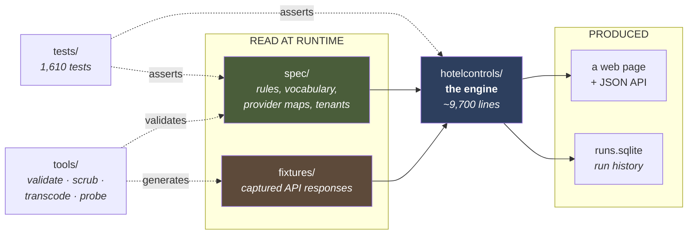

# 2 · Project File Structure — every folder, every file, and how they connect

> **Who this is for:** someone who has read [01-project-overview.md](01-project-overview.md) and now
> needs to find things. Every path below is real; every description says *why the file exists*, not
> just what it contains.

---

## 1. The five-second version

```
miniHotelPMS/
├── hotelcontrols/     THE ENGINE.  Python. Knows how to run a control. Knows no control.
├── spec/              THE RULES.   JSON data, read at runtime. 11 controls live here.
│   └── drafts/        COMPOSED RULES. Runnable, unreviewed, uncounted.
├── fixtures/          THE EVIDENCE. Captured API responses. Never edited.
├── tests/             THE PROOF.   1,610 tests. Offline. Four layers.
├── tools/             THE UTILITIES. Validate, pseudonymise, transcode, probe —
│   └── proposers/     and every MODEL BACKEND, deliberately outside the engine.
├── docs/              THE PROSE.   Including this folder.
└── miniHotelLegacy/   v1, PRESERVED. The mistake this codebase was built to avoid.
```

The critical separation, and everything else follows from it:

> **`hotelcontrols/` is a *player*. `spec/` holds the *discs*.**
>
> Nothing in `hotelcontrols/` knows what "the checkout balance control" is — it is one JSON file
> among eleven. That is what makes a twelfth control a config change rather than a code change, and
> it is verified by a test that compiles a brand-new control from an English sentence into a
> temporary directory and runs it end-to-end on both providers with no import touched.

---

## 2. How the top-level folders depend on each other



**Read that arrow direction carefully.** `spec/` and `fixtures/` flow *into* the engine as data. The
engine has no compile-time knowledge of either. Delete `spec/ir/checkout_money_owed.json` and the
engine does not fail to import — it simply offers ten controls instead of eleven.

---

## 3. `hotelcontrols/` — the engine

Eight layers. Each owns exactly one hard problem, and each hides everything about it. Dependencies
point **downwards only**: `kernel` imports nothing, `web` imports everything.

```
hotelcontrols/
├── kernel/       L1 · the vocabulary every layer speaks
├── spec/         L2 · loading and validating the rules
├── providers/    L3 · ◄── THE CANONICAL BOUNDARY. PMS knowledge stops here
├── evidence/     L4 · which records to look at, and what each costs
├── evaluator/    L5 · applying the rule. Pure. No I/O
├── runner/       L6 · orchestration, coverage, readiness, scheduling
├── store/        L6c · run history in SQLite
├── web/          L7 · routing and rendering
└── compiler/     L0 · English → IR. Runs BESIDE the stack, not inside it
```

### L1 · `kernel/` — the vocabulary. *Depends on nothing.*

Getting these types wrong invalidates every layer above, so they enforce their own rules rather
than trusting callers.

| File | Lines | What it is | The specific disaster it prevents |
| --- | --- | --- | --- |
| `value.py` | 209 | `Value = known(payload, unit) \| unknown(reason, risk)` — the only thing the provider layer hands upwards | **This is the heart of the product.** An unknown *raises* if you compare it. Without that, `PASS if v == 0 else FAIL` reports FAIL for a balance that was never established |
| `money.py` | 166 | `Decimal` amount + a mandatory currency | A reservation in USD meeting its own folio in ILS. Two currencies **refuse to compare** — except against literal zero, which means the same everywhere |
| `outcome.py` | 51 | `PASS · FAIL · UNKNOWN · EXCLUDED`, plus `is_answer` | Folding EXCLUDED into PASS, which turns "90 records were out of scope" into "90 passed" |
| `verdict.py` | 98 | `Verdict(outcome, reason, evidence[])` + `EvidenceLine` | The constructor **raises `NotAuditable`** on empty evidence or a blank reason. A verdict without receipts cannot be built at all |
| `clock.py` | 112 | `Clock` protocol, `PropertyClock`, `FixedClock` | Every date is a question about the **hotel's** calendar, never the server's. Enforced since slice 8 by an AST test: this is the only module allowed to read a wall clock |
| `errors.py` | 59 | `UnknownValue`, `CurrencyMismatch`, `UnitRequired`, `NotAuditable` | Every one is *raised*, never swallowed. A layer that returns a plausible default when it cannot answer manufactures confidence |

### L2 · `spec/` (the Python package) — loading and policing the rules

Note the two `spec`s: `hotelcontrols/spec/` is **code that reads**; `spec/` at the repo root is
**the data being read**.

| File | Lines | What it is |
| --- | --- | --- |
| `registry.py` | 163 | The canonical vocabulary. A rule may reference `folio.balance_due`; it may **not** reference whatever one PMS happens to call it. This is what makes "the rule never names a PMS" enforceable rather than aspirational |
| `ir.py` | 361 | Loads and validates a Control IR before anything tries to run it. Includes the cross-check that anything used in scope/exceptions/assertions is *also* declared as required evidence |
| `schema.py` | 193 | A deliberately small JSON-Schema validator. `jsonschema` is not in the standard library, and criterion 11 says the engine imports nothing that is not — so this implements exactly the subset `spec/ir_schema.json` uses, and **refuses** any keyword it does not support rather than ignoring it |
| `tenant.py` | 152 | One hotel's vocabulary and policy as data: status map, department map, timezone, call budget, nominated rate codes. In v1 these were dictionaries in a Python module, which made onboarding a second property a code change |
| `errors.py` | 59 | Spec failures. Each means: *fix the spec, not the engine* |

### L3 · `providers/` — **the canonical boundary**

> **This is the most important directory in the repository.** Everything PMS-shaped lives at or
> below this line and stops existing above it: wire formats, field paths, date formats, currency
> attachment, `0`-means-unset, per-property code maps, record boundaries.

| File | Lines | What it is |
| --- | --- | --- |
| `base.py` | 118 | The `Provider` protocol — 9 methods — plus `Request`, and the error types (`ResponseUnavailable`, `RecordBoundaryUnknown`) that callers turn into UNKNOWN rather than into a verdict |
| `registry.py` | 163 | **Discovers** adapters by importing sub-packages that declare themselves (`ADAPTER`, `FROZEN`, `CAPTURES`, `DEFAULT_CAPTURE`). A hard-coded `{"minihotel": MiniHotelAdapter}` would be the first place the boundary leaked |

#### `providers/minihotel/` — XML, real, captured from the vendor sandbox

| File | Lines | What it is |
| --- | --- | --- |
| `adapter.py` | 295 | `resolve(field, record) -> Value`. The entire interface the layer above sees |
| `paths.py` | 183 | Addressing a value inside a document **tree**. Replaces v1's regexes-over-raw-XML, where reordering two attributes silently turned a known date into UNKNOWN and XML entities were never decoded |
| `records.py` | 131 | Where one record ends and the next begins. Get this wrong and field 3 of booking 1 pairs with field 7 of booking 2 |
| `transforms.py` | 221 | Every MiniHotel quirk, one named function each: three date formats, `0`-means-unset, tenant status/department maps, `to_money` |
| `fixtures.py` | 230 | Replays captured responses **and replays the filters the way the live server would**. A request for a window the capture never covered **raises**, because "no data" and "nothing wrong" are different answers |
| `live.py` | 204 | What one of these calls looks like on the wire. Adapter knowledge, so it lives here — the transport itself knows no PMS |

#### `providers/demopms/` — JSON, fictional, generated

Same six-file shape (minus `live.py` — nobody has ever called DemoPMS, so it has no encoder; it can
be replayed but not probed, and that difference is reported rather than papered over).

**Its quirks were chosen to disagree with MiniHotel's**, because agreement would prove nothing:

| | MiniHotel | DemoPMS |
| --- | --- | --- |
| Dates | three formats (`dd/MM/yyyy`, `yyyyMMdd`, `yyyy-MM-dd`) | one (`07 Jul 2026`) |
| "Unset" sentinel | overloaded `0` | `-1` |
| Money | amount split from its currency | self-describing object |
| Occupancy | nested | sibling |

#### `providers/transport/` — opt-in, off by default

| File | Lines | What it is |
| --- | --- | --- |
| `http.py` | 371 | The only file in the engine that can open an outbound socket, **and it is off**. Two locks: an environment variable, *and* a refusal to arm while a test runner is loaded in the process |
| `ratelimit.py` | 77 | Token bucket. How fast this engine is allowed to be a guest on someone else's server |
| `record.py` | 144 | Writes a live response into the fixture set **with the request that produced it** — so probing stops being a hand-run script whose output somebody pastes somewhere |

### L4 · `evidence/` — bounded fetching

Cost is `1 + R + N`: one population call, one per reference set, one per record needing a follow-up.

| File | Lines | What it is |
| --- | --- | --- |
| `gather.py` | 227 | The orchestrator. Three sources **in cost order** — the population response (free), a reference (1 call per run, however many records want it), a per-record follow-up (1 call each). Every declared field is present as a `Value`; a gap is an unknown, never a missing key |
| `population.py` | 78 | Turns the IR's population query into request filters, resolving relative dates (`today-1d`) through the tenant clock. §24 of the brief: *"produce a population query, not an IF statement"* |
| `reference.py` | 122 | Joining a record to property-wide data. **This is the single largest functional gap in v1** — three of its controls returned 111 UNKNOWN out of 111 records because a stay could never be joined to its room |
| `cache.py` | 62 | One response, one call, for the length of a run. v1 cached per record, so a response fetched for record A was fetched again for record B |
| `budget.py` | 56 | The thing that stops a run. It **raises**; it never truncates |

### L5 · `evaluator/` — the rule, applied. **Pure.**

No I/O, no clock, no network, no knowledge of any PMS. That purity is what makes a verdict
reproducible six months later, and it is asserted by a test rather than assumed.

| File | Lines | What it is |
| --- | --- | --- |
| `record.py` | 144 | One record → one Verdict. The order is fixed: **scope → exceptions → assertion** |
| `population.py` | 78 | Questions about a *group*. "Two active reservations must not share a confirmation number" is not a property of a reservation — it is a property of the set. A second shape, not a special case of the first |
| `predicates.py` | 245 | One IR clause applied to one record's evidence. Every predicate returns **three** answers: holds, does not hold, or cannot tell |
| `intervals.py` | 64 | `within` / `not_within` / `overlaps`. v1 declared these in its schema and implemented none of them |

### L6 · `runner/` — orchestration and judgement

| File | Lines | What it is |
| --- | --- | --- |
| `run.py` | 168 | One control, end to end, in a box readable six months later. **Knows what no control is** — the control id names a file |
| `coverage.py` | 113 | *Did this run conclude anything?* `evaluated = PASS + FAIL`. A run with zero renders as *"reached no conclusion about any record"* — **never as four reassuring zeroes** |
| `readiness.py` | 120 | What a control could answer on a provider **before it is ever run**. This is the brief's §15–16: *"1 of 2 evidence sources connected"* |
| `scheduling.py` | 348 | `next_evaluation()` and `freshness_of()`, as **pure functions** with an injected clock. A control whose events a provider does not publish falls back to its interval and the plan **names the missing event** — with no fallback it is `unschedulable` rather than given a plausible interval |

### L6c · `store/` and L7 · `web/`

| File | Lines | What it is |
| --- | --- | --- |
| `store/sqlite.py` | 212 | Run history. A verdict that cannot be re-read is not an audit trail — and re-reading must not cost a provider call |
| `store/schema.sql` | — | Three timestamps that are three different facts: `as_of` (what date it describes), `observed_at` (when the evidence was obtained), `created_at` (when the run happened) |
| `web/app.py` | 523 | `handle(path) -> (status, content_type, body)`. **A pure function of the path** — which is why the whole demo is testable without a socket |
| `web/render.py` | 616 | Pure functions from objects to strings. UNKNOWN is distinguished from FAIL by **hue, border style *and* wording** — three signals, so it survives a monochrome screen or a colour-blind reader |
| `web/server.py` | 158 | The only file in the engine that knows a socket exists. Eleven lines of work around `handle()` |
| `web/assets/style.css` | — | Served from the package, never from a CDN |

### L0 · `compiler/` — English → IR. Runs *beside* the stack.

Nothing at runtime depends on it. It produces spec artefacts that L2 then validates.

| File | Lines | What it is |
| --- | --- | --- |
| `grammar.py` | 633 | A restricted-English parser. Deterministic, offline, no model. Emits **data**, then hands it to the same `spec.validate` that has policed hand-written rules since slice 1 |
| `model.py` | 111 | The seam for a proposal that is already IR — and not one gram of extra trust. Decision D9: built, exercised against a stub, no model wired. Its output goes through `ir.validate` unchanged |
| `sentences.py` | 235 | **Decision D10.** A `SentenceProposer` protocol and `normalise()`: prose → restricted English → the grammar above. Takes an injected proposer and **cannot acquire one** — which is what keeps this package free of anything that could open a socket |
| `problems.py` | 119 | What a compilation is, and `DEPLOYMENT_KEYS` — the list of things a *sentence* is not allowed to contain, because a sentence naming an endpoint would break criterion 5 |

---

## 4. `spec/` — the rules, as data

```
spec/
├── canonical_fields.json      THE VOCABULARY. Every field a rule may name.
├── ir_schema.json             The shape a control file must have.
├── ir/                        ELEVEN CONTROLS. One JSON file each.
├── providers/
│   ├── minihotel.json         canonical field → endpoint + path + transform
│   └── demopms.json           the same fields, a different API
└── tenants/
    ├── sandbox.json           one HOTEL's vocabulary (MiniHotel property)
    └── demo.json              one HOTEL's vocabulary (DemoPMS property)
```

### The eleven controls in `spec/ir/`

| Control id | Source control | The rule |
| --- | --- | --- |
| `checkout_money_owed` | 6 | A reservation cannot be closed while the guest still owes money |
| `checkout_unrefunded_credit` | 6 | A reservation cannot be closed while the **hotel** owes the **guest** a refund |
| `duplicate_channel_reservation` | 14 | Two active reservations must not share the same channel confirmation number |
| `inactive_room_future_stay` | 13 | No future reservation may reference an inactive or decommissioned room |
| `ooo_room_protection` | 2 | A room with an active out-of-service period must not have an arriving reservation |
| `rate_room_category_consistency` | 9 | A reservation using a rate may only be sold in categories that rate permits |
| `required_reservation_fields` | 15 | Every reservation on a given rate must record email, phone and ID number |
| `resource_occupancy_consistency` | 20 | A room must not be occupied by two overlapping reservations at once |
| `room_assignment_active_room` | 1d | A reservation must not be assigned to a room out of service on the stay dates |
| `room_assignment_type_validity` | 1a–1c | A reservation may only be assigned to a room that exists, of a defined type, matching what was booked |
| `room_capacity_compliance` | 4 | Guests assigned to a room must not exceed the room's configured capacity |

**Control 6 became two controls.** Money owed is a collections problem and a probable loss;
unrefunded credit is a liability with a different urgency and often a different team. One queue
makes severity meaningless for both. It was a *spec* change — and therefore the first real test of
"a twelfth control is a file, not a branch."

### What one control file contains

Every IR carries all of this. The two halves matter: **the sentence owns the logic; the deployment
owns the plumbing**, and the split is enforced both ways.

| Key | What it is | Which half |
| --- | --- | --- |
| `natural_language` | The prose a person wrote | sentence |
| `restricted_language` | The same rule in the controlled language the grammar parses | sentence |
| `entity` | What the control is about (`reservation`, `room`) | sentence |
| `scope` | Does this control *apply*? → EXCLUDED if not | sentence |
| `exceptions` | Is this record *exempt*? → EXCLUDED if so | sentence |
| `assertion` | The rule itself: `mode` (`all`/`any`/`none`/`aggregate`) + predicates | sentence |
| `references` | Property-wide data to join against | sentence |
| `required_evidence` | Every field needed, with `source` and `resolvable` | sentence |
| `population.provider_query` | Endpoint + filters + declared call cost, **per provider** | deployment |
| `execution` | Trigger mode, events, and the fallback interval | deployment |
| `freshness_requirement` | `maximum_age`, with a stated rationale | deployment |
| `action` | `notify`, severity, audience | deployment |
| `unknown_conditions` | When this control legitimately cannot answer, and why | sentence |
| `caveats` | Prose for whoever reads this in a year | — |

> A deployment carrying a `scope` clause is **refused**, because then the sentence printed beside a
> verdict would be a partial account of the rule that produced it.

### `spec/providers/*.json` — the interpreters' phrasebooks

One entry per canonical field. This is §13 of the design brief, made structural:

```json
{
  "canonical": "folio.balance_due",
  "endpoint":  "GetReservationBalance",
  "path":      "Balance/TotalDebit",
  "probe":     "5_balance_007003199.xml",
  "test":      "<TotalDebit>(.*?)</TotalDebit>",
  "transform": "to_money",
  "observed_populated": true,
  "notes":     "R9 - in folio.currency, NOT reservation.currency"
}
```

`probe` and `test` are the anti-fiction mechanism: **`tools/validate_spec.py` asserts every regex
against its named fixture.** A mapping cannot claim a field exists unless a captured response
proves it. `observed_populated: false` means *the field exists in the response but was empty in
every record we ever saw* — a structural mapping, not a behaviourally proven one.

### `spec/tenants/*.json` — one hotel's vocabulary, not the API's

Status codes and posting categories are **customisable per property**. So they belong to the
property, not to the adapter.

```json
"status_map":              { "OK": "confirmed", "IN": "checked_in",
                             "OUT": "checked_out", "CL": "cancelled" },
"known_unmapped_statuses": ["OK4", "WL", "LWP"],
"department_map":          {},
"call_budget":             101,
"settings": { "nominated_rate_codes": [], "rate_plan_permitted_room_types": {} }
```

Three of these deserve attention:

- **`known_unmapped_statuses` is deliberately unmapped**, so the gap is a *decision* rather than an
  oversight. `OK4` appears on 32 reservations and `WL` on 12 — together **44 of the 217 distinct
  reservations this project has ever seen** — and neither is documented anywhere. Each resolves to
  UNKNOWN.
- **`department_map` ships empty on purpose.** There is no provider-wide vocabulary for folio
  departments at all, so every one is UNKNOWN until a hotel supplies its own. That is what drives
  *"connect your finance mapping to enable this control"* rather than a wrong verdict.
- **`settings` is what only the hotel can supply.** `nominated_rate_codes: []` means one control
  excludes every record — useless but honest. v1 instead carried the literal string
  `"<hotel-nominated rate codes>"` inside a rule it then tried to run.

---

## 5. `fixtures/` — the evidence set

```
fixtures/
├── minihotel/
│   ├── raw/                   git-ignored. The unscrubbed captures. LOCAL ONLY.
│   ├── *.xml                  14 pseudonymised real responses
│   └── index.json             ◄── the request that produced each response
└── demopms/
    ├── *.json                 the same hotel, transcoded
    └── index.json
```

**Three rules, each bought with a specific failure:**

1. **Never edit a fixture to make a test pass.** Fixtures are evidence; change the code.
2. **`index.json` records what each fixture was *asked*.** v1 replayed filters without it, so a
   control querying a window the capture never covered got an empty population — which on screen is
   indistinguishable from "no violations."
3. **`fixtures/demopms/` is generated, never hand-written.** It is the MiniHotel captures
   re-encoded by `tools/transcode_demopms.py`, **gaps included**. A test asserts the rebuild is
   byte-identical.

> Give a person a blank file and the eleven controls they are about to run against it, and the
> fixtures drift towards the answers that look best. v1 shipped `fixtures/synthetic/` for exactly
> that reason, and it is exactly what went wrong. The folios nobody captured are still missing here;
> the statuses nobody can name are still unnameable; the 23 rooms with no configured capacity are
> still unconfigured. **A demo hotel that knew more than the real one would make the two-provider
> test pass by being a different hotel.**

Runs over DemoPMS report `evidence_is_synthetic`, because a run over records this repository
produced must say so.

---

## 6. `tests/` — 1,610 tests, four layers, zero network

```
tests/
├── unit/          Does this transformation do what the spec says?   (literal values)
├── integration/   Does this layer work on real captured responses?  (fixtures)
├── contract/      Does EVERY provider honour the protocol identically? (one suite, both)
└── e2e/           Does a run produce the right verdicts with evidence? (full stack)
```

### The tests that are load-bearing rather than routine

| Test | Count | What it guards |
| --- | --- | --- |
| `e2e/test_two_providers.py` | **105** | 11 controls × 3 as-of dates, per record id, **with identical call counts**, through XML and JSON. This is the whole thesis |
| `integration/test_scheduling_plans.py` | 124 | Every control's trigger plan on every provider |
| `integration/test_compiler_roundtrip.py` | 100 | All 11 controls recompile from their own restricted-English sentence to the same rule *and the same verdicts* |
| `contract/test_provider_contract.py` | 73 | One shared suite, parameterised over every registered provider. **Adding Mews means running an existing suite, not writing a new one** |
| `integration/test_web_pages.py` | 67 | The rendered page, without a socket |
| `unit/test_transport.py` | 58 | Including: the test that sets the enabling environment variable **and is refused anyway** |
| `e2e/test_runs.py` | 46 | Holds the concluding/blocked/non-concluding control sets **by name**, so a change turns a test red rather than passing quietly |
| `unit/test_canonical_boundary.py` | 31 | Greps the tree for 28 identifiers from **both** providers, with allowed directories *discovered* rather than listed |
| `integration/test_transcode_fidelity.py` | 20 | The DemoPMS fixtures still match a rebuild, byte for byte |
| `unit/test_clock_is_always_injected.py` | 5 | An **AST walk over the whole engine**: `kernel/clock.py` is the only module allowed to read a wall clock |
| `unit/test_stdlib_only.py` | 2 | Walks the source tree and asserts the engine contains no outbound HTTP client at all |
| `unit/test_web_compose.py` | 41 | The compose window: off by default, an absence *stated* not 404'd, a refusal that names the field, a question with no run button, and **still no JavaScript** |
| `unit/test_compose_normalise.py` | 29 | Prose → sentence → rule against a stub. §17's gate and §18's restraint, plus reply parsing across five wrapping styles |
| `unit/test_proposers_refuse_in_tests.py` | 25 | **No test reaches a model.** Both live backends refuse inside a test process *with their variable set* — the transport's own proof pattern |
| `integration/test_draft_lifecycle.py` | 15 | A rule composed from prose runs on **both** providers with identical verdicts and identical call counts |

> **`PYTHONDONTWRITEBYTECODE=1` is a correctness gate, not hygiene.** An edit that changes neither a
> file's size nor its mtime-second leaves a stale `.pyc` valid, so the suite runs the *old* code and
> reports a green that means nothing. This happened twice in v1.

---

## 7. `tools/` — four scripts, each with a reason

| Command | What it does | Why it exists |
| --- | --- | --- |
| `python3 -m tools.validate_spec` | Validates the vocabulary, the rules, the provider maps, the tenants — **1,080 checks** | Not ceremony. It caught four rules whose joins read a field they never declared, **on its first real run.** It is also the gate that makes a natural-language compiler safe to add |
| `python3 -m tools.scrub_fixtures <in> <out>` | Pseudonymises a raw capture | The captures carry **27 email addresses and 30 phone numbers** from someone else's sandbox, plus free-text remarks naming a guest. This repository is public |
| `python3 -m tools.transcode_demopms --check` | Rebuilds the DemoPMS fixtures and verifies nothing changed | Makes "the same hotel through two providers" a checked claim rather than a decorative one |
| `python3 -m tools.probe --plan` | Prints exactly what a live probe *would* ask. **Makes no calls** | The vendor asks integrators not to query wide ranges without agreement. Live calls are opt-in, staged, bounded, and approved individually |
| `python3 -m tools.serve --llm local` | The demo **with the compose window** at `/compose` | Decision D10. This is where the dependency arrow turns around: the model client lives here, outside the engine, and is injected into the app. `hotelcontrols/` still imports only the standard library |

### `tools/proposers/` — the model backends, deliberately outside the engine

| File | What |
| --- | --- |
| `base.py` | The system prompt, **generated** from `spec/canonical_fields.json`, the grammar's own operator tables and six shipped sentences — so it cannot drift from the language it describes. Also the two locks |
| `local.py` | Ollama over stdlib `urllib`. **Free, offline, zero dependencies.** The default |
| `anthropic_api.py` | `claude-haiku-4-5` with the vocabulary cached. Optional `anthropic` extra |
| `stub.py` | Fixed replies. **The only backend any test wires** — and it exercises the validator harder than a real model would, because it emits exactly the proposals that reach each outcome |

---

## 8. Root files

| File | What it is |
| --- | --- |
| `CLAUDE.md` | Two-minute orientation for a coding session: the four ideas, the seven facts that bite, the conventions, the rules |
| `README.md` | The pitch, the status, and the honest scorecard |
| `pyproject.toml` | **No runtime dependencies and not packaged for distribution.** It configures pytest and a 90% coverage floor — *"a floor, not a target. Coverage says a line ran; it does not say the line was checked"* |
| `requirements-dev.txt` | `pytest` + `coverage`. Never imported by `hotelcontrols/` |
| `.env.example` | Credential variable names only. **No credentials in source, ever** — environment only, with no default, so a missing one fails loudly |
| `.github/workflows/ci.yml` | Python 3.11 (the floor) and 3.13 (what we develop on). Required on every PR to `main` |

---

## 9. `miniHotelLegacy/` — v1, preserved on purpose

Not dead weight. It is the **measured baseline**, and three things in it still govern:

| Path | Why it is still here |
| --- | --- |
| `Hotel Controls.docx` | **A source document.** The twenty controls |
| `control_rule_architecture.docx` | **A source document.** The twenty-five-section design brief |
| `MiniHotel_Controls_API_Feasibility.xlsx` | The original deliverable: 20 controls × required APIs |
| `CONTROL_DRY_RUN.md` | Ten controls walked through the architecture **by hand, before any code was written.** This is v2's specification input |
| `engine/` (four silos) | 152 passing tests, one working control — and the measurement that only **1 of its 10 controls ever answers** |

---

## 10. Where a change actually goes

The table people most often want:

| You want to… | Touch | Do **not** touch |
| --- | --- | --- |
| Add a **twelfth control** | a new `spec/ir/*.json` | anything in `hotelcontrols/` |
| Add one **from prose** | nothing — use `/compose`; it files a draft in `spec/drafts/` | anything at all |
| **Promote** a draft | `git mv spec/drafts/ir/x.json spec/ir/` then `tools.validate_spec` | — |
| Add a **model backend** | a file in `tools/proposers/` + a name in its `build()` | anything in `hotelcontrols/` — the guards will fail |
| Add a **new PMS** | `providers/<name>/`, `spec/providers/<name>.json`, `spec/tenants/*.json`, fixtures | anything above `providers/` — the slice-7 diff is the evidence |
| Onboard a **new property** on an existing PMS | `spec/tenants/<id>.json` | any Python at all |
| Fix a **field mapping** | `spec/providers/<pms>.json` + that adapter's `transforms.py` | the IR, the evaluator |
| Change **what a rule means** | that control's `spec/ir/*.json` | the evaluator |
| Change **how a verdict is decided** | `evaluator/` — and expect the blast radius to be every control | — |
| Change **when a control runs** | the IR's `execution` block | `scheduling.py`, unless the *policy* is wrong |
| Add a **new canonical field** | `spec/canonical_fields.json`, then both provider maps | — |

> **The rule that outranks every other rule in this repository:** never widen a verdict. If evidence
> is missing the answer is UNKNOWN. Turning an UNKNOWN into a PASS to make a test green, a number
> look better, or a demo look finished defeats the entire product.

---

**Next:** [03-code-architecture.md](03-code-architecture.md) — the same system as diagrams: the
request lifecycle, the control flow, the decision logic, and the data shapes.
