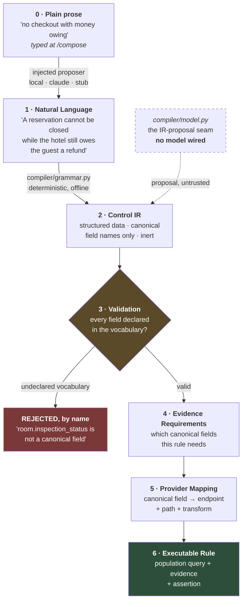
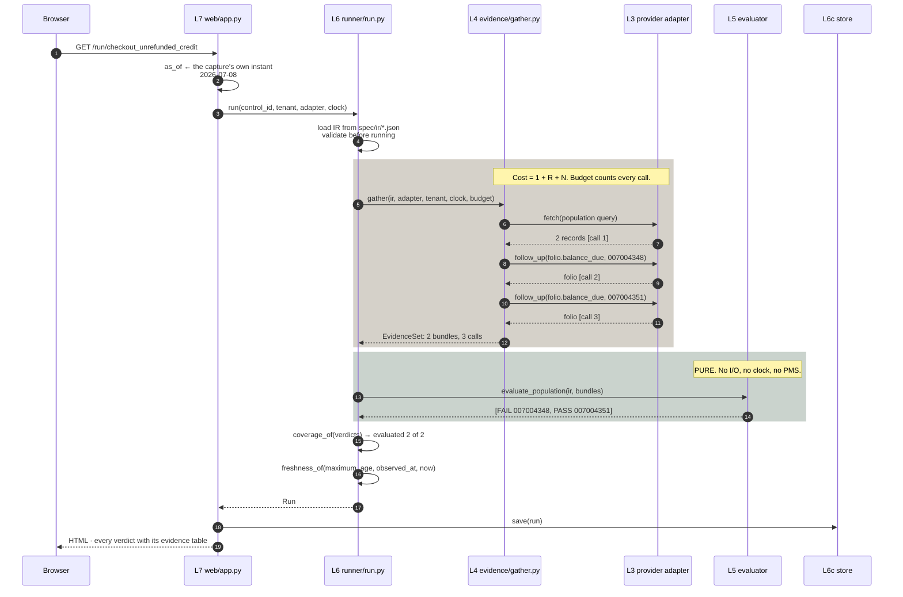
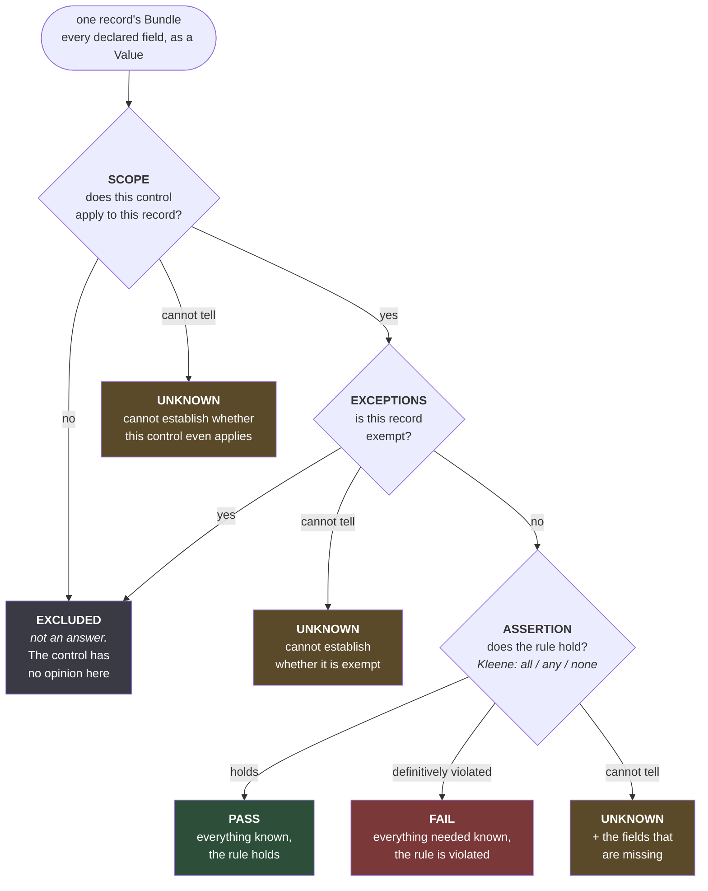
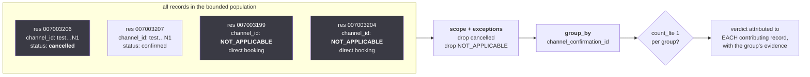
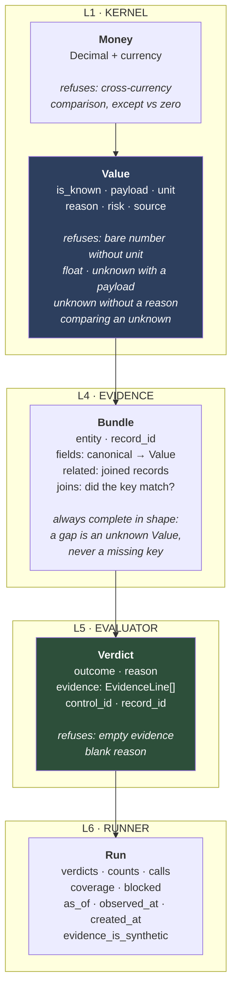
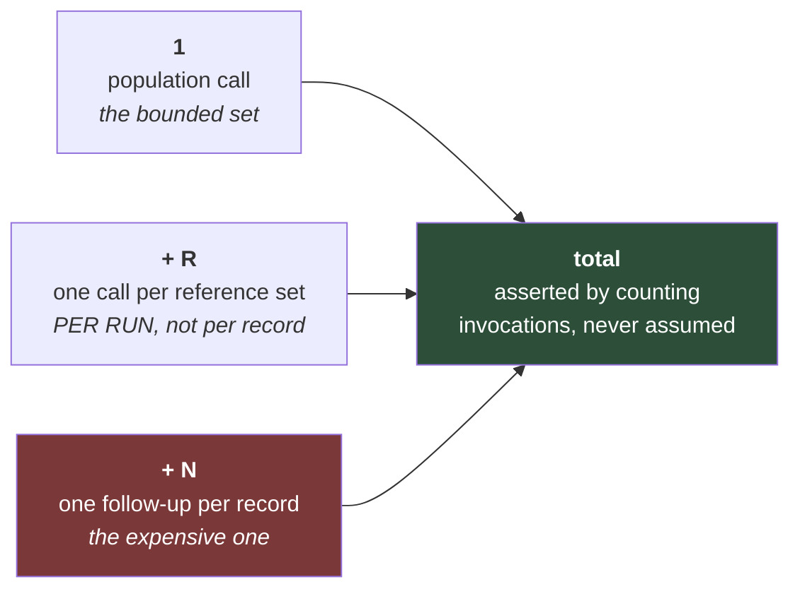
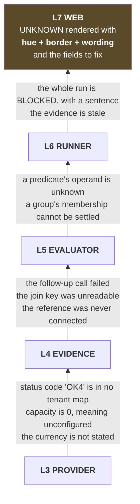
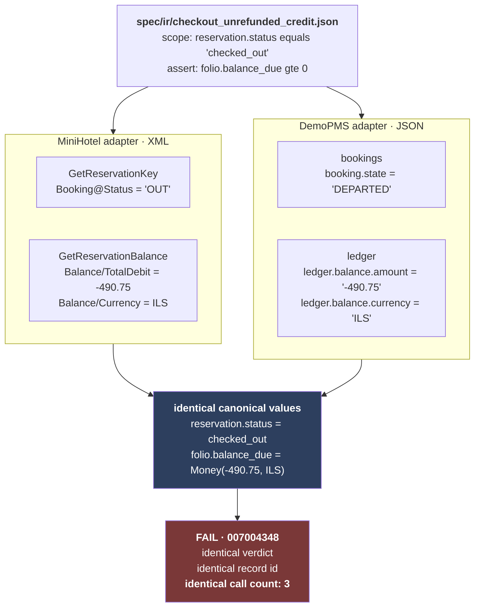
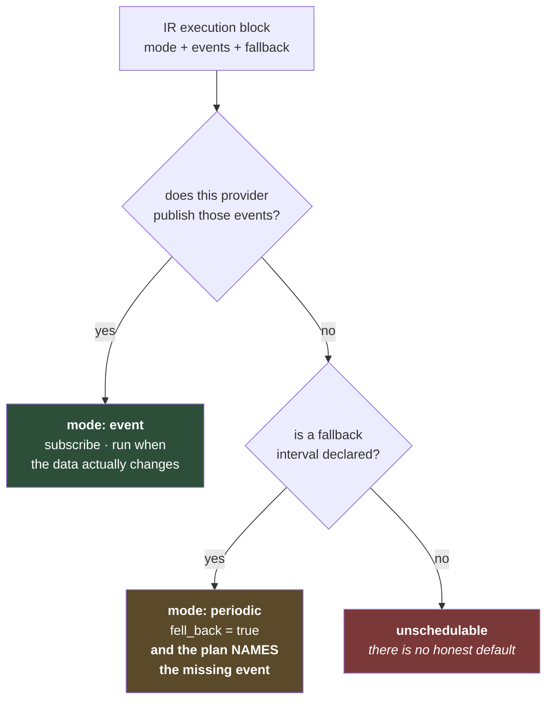

# 3 · Code Architecture — the system as diagrams

> **Who this is for:** someone who now knows what the project is and where the files are, and wants
> to see how a question travels through the code. Every number and every quoted string in this
> document was produced by running the engine, not copied from a design doc.

---

## 1. The stack

Eight layers. Each is a **deep module**: a wide capability behind a narrow interface. Evidence flows
**up**; calls go **down**. Nothing above the provider layer knows a PMS exists.

```
                  ┌───────────────────────────────────────────────────┐
                  │  Browser · one page per control, evidence inline  │
                  └───────────────────────▲───────────────────────────┘
                                          │
 ┌────────────────────────────────────────┴────────────────────────────────────────┐
 │ L7 · WEB            handle(path) -> (status, content_type, body)                 │
 │ routing · server-side rendering · JSON API · no framework, no JavaScript         │
 └────────────────────────────────────────▲────────────────────────────────────────┘
                                          │ run(control_id, tenant, evidence, as_of)
 ┌────────────────────────────────────────┴────────────────────────────────────────┐
 │ L6 · RUNNER         orchestration · Run + coverage verdict · readiness           │ ─ UNKNOWN:
 │      ┌──────────────────┬────────────────────┬──────────────────────┐            │   run blocked
 │      │ L6a readiness    │ L6b scheduling     │ L6c store (sqlite)   │            │
 │      └──────────────────┴────────────────────┴──────────────────────┘            │
 └────────────────────────────────────────▲────────────────────────────────────────┘
                                          │ evaluate_population(ir, bundles) -> [Verdict]
 ┌────────────────────────────────────────┴────────────────────────────────────────┐
 │ L5 · EVALUATOR      predicates · Kleene logic · scope · exceptions · aggregates  │ ─ UNKNOWN:
 │ PURE. No I/O, no clock, no network, no PMS. Asserted by test, not assumed        │   value unknown
 └────────────────────────────────────────▲────────────────────────────────────────┘
                                          │ gather(ir, tenant, as_of) -> EvidenceSet
 ┌────────────────────────────────────────┴────────────────────────────────────────┐
 │ L4 · EVIDENCE       population · reference sets · run-scoped cache · budget      │ ─ UNKNOWN:
 │ hides: that a folio costs one call per record, and how a join is keyed           │   fetch failed
 └────────────────────────────────────────▲────────────────────────────────────────┘
                                          │ resolve(field, record) -> Value
─ ─ ─ ─ ─ ─ ─ ─ ─ ─ ─ ─ ─ ─ ─ ─ ─ ─ ─ ─ ─ ┼─ ─ ─ ─ ─ ─ ─ ─ ─ ─ ─ ─ ─ ─ ─ ─ ─ ─ ─ ─ ─
CANONICAL BOUNDARY — no PMS name, endpoint, path or wire format appears above this line
 ┌────────────────────────────────────────┴────────────────────────────────────────┐
 │ L3 · PROVIDERS      Provider protocol · one adapter per PMS                      │ ─ UNKNOWN:
 │      ┌─────────────────┬──────────────────┬─────────────────────┐                │   unmapped code,
 │      │ minihotel (XML) │ demopms (JSON)   │ transport (opt-in)  │                │   0-means-unset,
 │      └─────────────────┴──────────────────┴─────────────────────┘                │   currency unknown
 └────────────────────────────────────────▲────────────────────────────────────────┘
                                          │ load_ir / registry / tenant config
 ┌────────────────────────────────────────┴────────────────────────────────────────┐
 │ L2 · SPEC           canonical field registry · IR schema + loader · validator    │
 │      · tenant configuration (status maps, timezone, budget, nominated codes)     │
 └────────────────────────────────────────▲────────────────────────────────────────┘
                                          │
 ┌────────────────────────────────────────┴────────────────────────────────────────┐
 │ L1 · KERNEL         Value · Money(Decimal) · Outcome · Verdict · Clock · errors  │
 │ the vocabulary every other layer speaks. Depends on nothing                      │
 └─────────────────────────────────────────────────────────────────────────────────┘

 L0 · COMPILER  (English -> IR)  runs BESIDE the stack, not inside it: it produces spec
                artifacts that L2 validates. Nothing at runtime depends on it.
```

**Three properties matter more than the boxes:**

1. **UNKNOWN originates at every layer.** It is not an error path. Any layer can legitimately
   produce it, and it must reach the screen without being flattened into a pass or a failure.
2. **The canonical boundary is absolute.** That is what makes a second PMS an adapter rather than a
   rewrite.
3. **Purity is load-bearing at L5.** The evaluator is a function of `(IR, evidence)` and nothing
   else — which is the difference between an audit trail and an anecdote.

---

## 2. The six-stage pipeline

§17 of the design brief is explicit: **never `LLM → executable JSON` directly.** So a sentence
becomes *data*, and that data has to survive a validation gate before anything can run it.



**The gate is the whole point, and it already works.** Fed the design brief's own trick example —
*"All VIP arrivals should have an assigned room that is clean by 2 PM"* — the validator answers with
the **two canonical fields that do not exist**, rather than producing a rule that runs and quietly
answers about nothing.

Two things to notice.

**Stage 0 is new** (decision D10, slice 13). A model may now draft the *sentence* at stage 1 — never
the IR. It is an **injected** proposer: `hotelcontrols/compiler/sentences.py` defines the protocol
and takes one as a parameter; every backend lives in `tools/proposers/`, outside the engine. So a
composed control still arrives at stage 2 carrying `confidence == 1.0` and `source == "grammar"`,
because the parse was exact whatever wrote the text it parsed. And a wrong field name is not bad IR
that slipped through — it is a sentence stage 3 refuses *by name*.

**The dashed arrow is still dashed.** The direct IR-proposal seam is *built and exercised against a
stub*, with no model wired (decision D9). `confidence` is reported and **never acted on**: a
deterministic parse is `1.0` because the parse is exact rather than probable; a model's IR proposal
is `None`, because nothing there established a number and a model's opinion of itself is not
evidence.

---

## 3. One request, end to end

What actually happens when someone opens `/run/checkout_unrefunded_credit`.



**Two design decisions visible in that trace:**

- **`as_of` defaults to the instant the *evidence* describes, not to today.** A capture of July
  answers questions about July. Asking today's date instead would produce a page of refusals for a
  reason that has nothing to do with the controls. The page always states which instant it asked
  about; `?as_of=` overrides it; a date the engine cannot read is **refused rather than guessed at**.
- **The run is saved on a GET.** Asking the same control the same question over the same evidence at
  the same instant produces the same `run_id`, so a refresh *replaces* rather than duplicating — the
  history records distinct questions, not page loads.

---

## 4. The decision: how one record gets one verdict

This is the core control flow, and **the order is load-bearing**.



> **A control that cannot establish whether it even applies has not passed, and it has not excluded
> anything either.** It has nothing to say yet, and says so.

Every verdict carries a `reason` and an `evidence` table. That is not a convention —
`Verdict.__init__` **raises `NotAuditable`** if either is empty. You cannot construct an
unexplained verdict.

---

## 5. Three-valued (Kleene) logic — not "any unknown wins"

When an assertion has several predicates, they combine like this:

| mode | rule |
| --- | --- |
| `all` | any **False** → **FAIL** · else any unknown → **UNKNOWN** · else **PASS** |
| `any` | any **True** → **PASS** · else any unknown → **UNKNOWN** · else **FAIL** |
| `none` | any **True** → **FAIL** · else any unknown → **UNKNOWN** · else **PASS** |

**The first line is the subtle one.** Under `all`, one predicate that definitively fails is a
complete answer — an outstanding balance is a violation whether or not some unrelated field was
missing. Calling that UNKNOWN would hide a real violation behind an irrelevant gap.

**The reverse must never happen:** a would-be *pass* outranking a missing field. Both directions are
tested.

```
  balance = 250 ILS  (known, violates)      ┐
  approval_flag      (unknown)              ├─ mode: all  →  FAIL   ✅ correct
                                            ┘   the violation is complete on its own

  balance            (unknown)              ┐
  status = checked_out (known, satisfies)   ├─ mode: all  →  UNKNOWN ✅ correct
                                            ┘   never PASS
```

---

## 6. Population assertions — a second shape, not a special case

Some rules are not properties of a record at all. *"Two active reservations must not share the same
channel confirmation number"* is a property of **the set**.



**Both exclusions are mandatory, and each was bought with a real record:**

- **Cancelled must be dropped.** MiniHotel processes an OTA *modification* as **cancel + recreate,
  reusing the same confirmation number.** Confirmed live: `test0000000N1` is shared by `007003206`
  (cancelled) and `007003207` (active). Without this exclusion, **every guest who ever changed a
  booking is reported as a duplicate.**
- **`NOT_APPLICABLE` must never be grouped.** 7 of 11 sandbox bookings are direct and carry no
  channel id at all. Group them together and every direct booking is a duplicate of every other.

That is why `NOT_APPLICABLE` is a distinct sentinel rather than an empty string or `None`. *"There
is no channel confirmation because there was no channel"* is **a fact, not a gap** — a *known*
value, not an unknown one.

---

## 7. The data shapes

Four types carry everything. Each refuses to be constructed in an unsafe state.



### `Bundle.joins` — the distinction that keeps a join honest

A three-valued answer, kept separate from the resolved fields:

| | Meaning | Verdict consequence |
| --- | --- | --- |
| `known(True)` | the key matched a record in this property | join succeeded |
| `known(False)` | the key was readable and matched **nothing** | **a definite finding** — a stay assigned to a room the master does not hold is a violation |
| `unknown(why)` | the key was unreadable, or the reference could not be fetched | **UNKNOWN** |

> *"The room is not in the master"* and *"we could not read the master"* must never produce the same
> verdict. **A join never invents a match** — wrong evidence behind a right-looking verdict is the
> worst thing this system can produce.

### The three timestamps on a `Run`, which are three different facts

| Field | Answers |
| --- | --- |
| `as_of` | **What date is this run about?** (`2026-07-08`) |
| `observed_at` | **When was the evidence obtained?** — drives freshness |
| `created_at` | **When did the run happen?** — from the injected clock, never `datetime.now()` |

---

## 8. The cost model: `1 + R + N`

Evidence costs money and goodwill, so the shape of the bill is part of the design.



**Three sources of evidence, in cost order — and the ordering *is* the design:**

| Source | Cost | Why |
| --- | --- | --- |
| the population response | **free** — already fetched | |
| a reference | **1 call per run**, however many records want it | The room master answers for all 111 stays at once. v1 had no way to say this, and three of its controls returned **111 UNKNOWN out of 111 records** |
| a per-record follow-up | **1 call per record** | A folio takes one reservation per call and no bulk journal endpoint exists. This is why a population query exists at all |

**Measured, on the 2026 capture:**

| Control | Calls | Shape |
| --- | --- | --- |
| `duplicate_channel_reservation` | **1** | population only — grouped in memory |
| `checkout_unrefunded_credit` | **3** | 1 population + 2 folios (`1 + N`, N=2) |
| `room_assignment_type_validity` | **3** | 1 population + 2 references (`1 + R`, R=2) |

### The budget raises; it never truncates

```
BudgetExceeded  ──►  the RUN stops, and says so
                     "This run was stopped by its call budget: …"

NOT:            ──►  degrade one record and carry on
                     …which produces "no violations found" about
                       records nobody looked at
```

This is explicit in the code: `gather()` catches `ProviderError` per record (a fetch failure
degrades *one* bundle) but deliberately **lets `BudgetExceeded` propagate**.

Equally: **the evidence layer does not filter the records the provider returned.** The population
query is a **bound**, not a verdict. Deciding a record is out of scope is L5's job — keeping those
two things apart is what stops "we only fetched 3 records" from silently becoming "3 records
passed."

---

## 9. UNKNOWN originates at every layer

Not an error path. A legitimate answer that must survive to the screen intact.



**Three signals, not one.** UNKNOWN is distinguished from FAIL by hue, border style *and* wording —
so the distinction survives a monochrome screen or a colour-blind reader. That is asserted by a
rendering test that strips every colour tag and checks the wording still separates them.

And `Verdict.unknown_fields` is where the commercial value lives:

> Without it the answer is *"we don't know."*
> With it the answer is *"connect this and we will."*

---

## 10. Portability: the same rule through two incompatible APIs

The thesis, and the thing that is checked rather than asserted.



`tests/e2e/test_two_providers.py` — **105 tests**: 11 controls × 3 as-of dates, per record id, with
call counts compared too. The side-by-side proof is in
[04-edge-cases.md](04-edge-cases.md) Part B.

**How the boundary is actually held:**

| Mechanism | What it does |
| --- | --- |
| `providers/registry.py` | **Discovers** adapters by importing sub-packages that declare `ADAPTER`, `FROZEN`, `CAPTURES`, `DEFAULT_CAPTURE`. A hard-coded dict of `{"minihotel": …}` would be the first leak |
| `tests/unit/test_canonical_boundary.py` | Greps the tree for **28 identifiers from both providers**, with allowed directories *discovered* rather than listed. Strict enough that it has caught prose |
| `tests/contract/test_provider_contract.py` | **73 tests**, one suite parameterised over every registered provider. Adding Mews means running an existing suite |
| `Value.source` | The **one** thing carrying a provider name that crosses the boundary — and it crosses as **opaque audit data** (`pms:minihotel/GetReservationBalance`). No layer above ever parses it |

---

## 11. Scheduling and freshness — pure functions, no daemon

The scheduling *decision* is built and tested. The loop is out of scope.



> **`unschedulable` rather than a plausible interval.** Inventing one produces a control that merely
> *appears* to be running. That is the scheduling form of turning an UNKNOWN into a PASS.

Measured — MiniHotel publishes `reservation.created`, `reservation.updated`,
`room.occupancy_updated`:

```
checkout_money_owed         declared=event    actual=event
   "This provider publishes reservation.updated, so the control runs
    when the hotel's data actually changes."

inactive_room_future_stay   declared=periodic actual=periodic
   "It is re-checked every 6 hours, because the state it watches can
    change with no event at all."
```

**Freshness is the same rule applied to time.** A `Run` records when its evidence was *obtained*, as
distinct from what date it *describes*. `freshness_of()` compares that against the IR's
`maximum_age`.

- Evidence whose age **cannot be established is stale**, never assumed current.
- **A stale run still shows every verdict** — staleness *qualifies* an answer rather than removing
  it.

---

## 12. Readiness — what a control can answer *before* it is ever run

This is §15–16 of the design brief, and it is a commercial instrument as much as a technical one.

```
checkout_money_owed              5/5   executable ✅
rate_room_category_consistency   3/5   executable ❌
     unresolvable:      rate_plan.permitted_room_types
     tenant_supplied:   rate_plan.code
```

Three different reasons a field might be unavailable, and they lead to three different
conversations:

| Category | Meaning | The next step |
| --- | --- | --- |
| **available** | this provider maps it | — |
| **unresolvable** | **no provider we have can supply it.** A fact about the vocabulary, not a bug | *"Connect your housekeeping system to enable this control"* |
| **tenant_supplied** | the *hotel* must supply it — nominated rate codes, a rate-plan mapping | *"Tell us your rate codes and this starts answering"* |

Rendered on the index page per control per provider, and served at
`/api/readiness/<control_id>`.

---

## 13. Coverage — did this run conclude *anything*?

The most valuable thing the runner does, and the thing v1 lacked entirely.

```
evaluated = PASS + FAIL          EXCLUDED and UNKNOWN are not conclusions
```

Real output, `ooo_room_protection` on the 2026 capture:

```
evaluated = 0   total = 28   concluded = False

  "This control reached no conclusion about any of its 28 record(s).
   It has not found the property compliant; it has not looked."

  reasons:
    28 × "this control does not apply here: room.closed_from is False,
          which does not satisfy `exists`"
```

**A run with `evaluated == 0` renders with no count tiles at all.** v1 reported *28 EXCLUDED / 0
FAIL* for this exact control, on a property where the out-of-service mechanism has never been
observed working — and on screen it was **indistinguishable from a clean bill of health.**

Note that `Coverage` keeps the full **distribution** of reasons, not just the dominant one. A single
reason is often the least informative: *"71 of 111 stays are cancelled"* is a correct exclusion and
tells a hotel nothing. Showing the distribution lets a reader see both that most records were out
of scope **and** what happened to the rest.

---

## 14. Where each invariant is actually enforced

Nothing here relies on someone remembering. Each row is a mechanism.

| Invariant | Enforced by | Kind |
| --- | --- | --- |
| No PMS identifier above L3 | `test_canonical_boundary.py` — greps 28 identifiers, allowed dirs discovered | test |
| The evaluator is pure | asserted by test; no imports of I/O in `evaluator/` | test |
| Only `kernel/clock.py` reads a wall clock | **an AST walk over the whole engine** | test |
| A verdict has evidence and a reason | `Verdict.__init__` raises `NotAuditable` | type |
| A number has a unit; money has a currency | `Value.__post_init__` raises `UnitRequired` | type |
| An unknown never compares | `Value.comparable_pair` raises `UnknownValue` | type |
| Cross-currency never compares | `Money.comparable_with` raises `CurrencyMismatch` | type |
| No floats in evidence | `Value._validate_known` raises `TypeError` | type |
| Calls are `1 + R + N` | invocations **counted**, at L4 and again end-to-end | test |
| No test reaches the network | `test_stdlib_only.py`; transport needs **two locks**, and the test that sets the env var is still refused | test |
| A twelfth control needs no code | a never-before-seen control compiled from a sentence, run on both providers | test |
| No model client exists in the engine | an AST walk asserting `hotelcontrols/` imports no backend, and that `compiler/sentences.py` imports only `re`/`dataclasses`/`typing` | test |
| No test reaches a model | both live proposers refuse while a test runner is loaded, **with their variable set** | test |
| A composed draft is as portable as a shipped rule | identical verdicts **and call counts** on both providers, for a rule drafted from prose | test |
| DemoPMS fixtures are not hand-tuned | `test_transcode_fidelity.py` — byte-identical rebuild | test |
| A spec claim matches captured evidence | `tools/validate_spec.py` asserts every mapping regex against its named fixture | tool |
| A slice does not merge until green | GitHub Actions on 3.11 and 3.13, required on every PR | CI |

---

**Next:** [04-edge-cases.md](04-edge-cases.md) — the seven facts about the real API that forced
every decision above, and one real reservation traced from raw XML to the screen.
