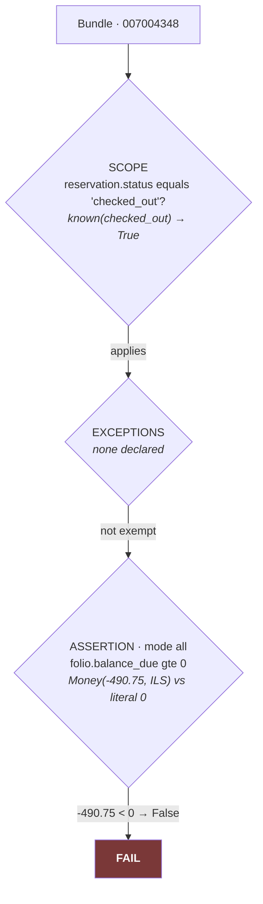

# 4 · Edge Cases & A Worked Trace

> **Part A** — the facts about the real API that shaped every design decision. Each was found by
> **calling the API, not by reading its documentation**, and each carries a risk id used throughout
> the code, the tests and the docs.
>
> **Part B** — one real reservation walked from raw XML to the pixel on screen, through all eight
> layers, then repeated through a completely different JSON provider.
>
> Every fixture excerpt, count and output below was re-verified against the repository while
> writing this document.

---

## The method, and why it matters

Three passes were made against the vendor sandbox, and the order is the finding:

| Pass | What it was | What it produced |
| --- | --- | --- |
| 1 | Documentation review — ~25 reference pages | The first feasibility rating, and risks R1–R8 |
| 2 | **Seven live read-only calls** | **Documentation review got 4 of 12 risks wrong** |
| 3 | The checkout probe — seven more calls, staged, one second apart | The sandbox had moved on to 2026 data; a checked-out folio can be **negative** |

> **The rule this produced, now binding:** *if the documentation and a captured response disagree,
> the response wins.* A spec validator exists so that a claim cannot sit unchecked — `probe` and
> `test` keys in every provider mapping are asserted against the named fixture.

---

# PART A · The facts that bite

## R9 — A reservation and its own folio are in different currencies

**The worst one, and it is not a bug — it is how the system works.**

```xml
<!-- fixtures/minihotel/3_GetReservationKey.xml · reservation 007003199 -->
<Total AmountAfterTaxes="870.00" CurrencyCode="USD" />
```
```xml
<!-- fixtures/minihotel/5_balance_007003199.xml · the SAME reservation's folio -->
<Currency>ILS</Currency><Debit>3262.5</Debit><Credit>0</Credit><TotalDebit>3262.5</TotalDebit>
```

**870 USD** on the reservation. **3,262.50 ILS** on its own folio. **No exchange rate exists
anywhere in the API.**

The naive reconciliation control — *"does the folio balance match the reservation total?"* — is not
merely wrong here. It is **unanswerable**, and any implementation that answers it is inventing an FX
rate.

| What it forced | Where |
| --- | --- |
| Money carries its currency or it is not evidence | `kernel/money.py` |
| Two currencies **refuse to compare** — they raise `CurrencyMismatch` | `Money.comparable_with` |
| **Except against literal zero**, which means the same amount in every currency | the one exception, and it is why the checkout controls are safe |
| A bare number cannot be a `Value` without a unit | `Value.__post_init__` raises `UnitRequired` |

Both checkout controls compare against **zero**, sidestepping R9 by construction. Both IRs carry an
explicit `unknown_conditions` entry saying that any future variant comparing the two amounts is
invalid without an external FX source. And both carry `reservation.currency` in their evidence table
**purely so a human can see the trap** — you will see it in Part B.

---

## R10 / R12 — `0` usually means "nobody configured this", not zero

Verified by counting the fixture: **28 rooms** (`<rm_number>` × 28), of which **23 have no usable
adult capacity** — 21 report `0`, and 2 carry no capacity element at all.

```
adult capacity across the 26 rooms that declare one:
    0  ×21        ← "nobody configured this"
    2  ×3
    3  ×1
    6  ×1
```

A room that holds zero adults is not a room. Some per-room *prices* are `0` on demonstrably paid
bookings too.

**Read those as real zeroes and the capacity control produces a wall of false FAILs against 23 of
28 rooms.** The transform is named for what it means:

```json
{ "canonical": "room.max_guests.adults", "transform": "zero_is_unknown",
  "notes": "R12 - 0 on 23 of 28 rooms" }
```

This is the direct cause of `room_capacity_compliance` reaching **40 UNKNOWN and 0 conclusions** —
and it is the correct outcome.

---

## R3 / R2 — three date formats, and `createDateTime` is date-only

One API, three formats:

| Format | Where | Example |
| --- | --- | --- |
| `dd/MM/yyyy` | booking attributes | `07/07/2026` |
| `yyyyMMdd` | folio transactions, ARI days | `20260707` |
| `yyyy-MM-dd` | ARI date ranges | `2026-07-07` |

**Formats are parsed strictly and never fall back to each other.** A fallback chain turns
`03/04/2026` into a coin flip between March and April.

And `createDateTime` carries **no time component**:

```xml
<Booking Minihotel_reservation_id="007004348" createDateTime="07/07/2026" Status="OUT" ... >
```

So *"reservations created after the scheduled arrival time"* — control 12 in the source document —
**cannot be answered at same-day precision.** That is stated, not implied, and the control says so
rather than comparing a date against a time and calling it a day.

---

## R13 — the same room type, spelled two ways

```
BulkARI says:              "DBL"  "EXECUTIVE"  "SNG"  "TRP"  "TWIN"
the room-type master says:  DBL    Executive    SNG    TRP    Twin
```

**Always compare case-insensitively.** A case-sensitive join silently turns a valid room type into a
violation.

R13 has a second, worse half: **a reservation's rate code and the ARI price-list code are different
key spaces entirely.** They are not the same identifiers in different cases — they are different
identifiers. No endpoint resolves the mapping.

That is why `rate_room_category_consistency` reports readiness **3/5** with
`rate_plan.permitted_room_types` marked **unresolvable**, and answers UNKNOWN with that reason
rather than guessing at a join.

---

## R11 — live data that contradicts itself

Rooms `9900`, `9901` and `9902` declare room type **`Double`**. The room-type master defines nine
types, and `Double` is not among them (it defines `DBL`).

This is **a real latent defect in the hotel's live data**, found by running control 1 rather than by
reading anything. The engine **reports it** — `known(False)` on the join, which is a definite
finding — rather than crashing or silently skipping the record.

> This is precisely why `Bundle.joins` is three-valued. *"The room type is not in the master"*
> (a violation) and *"we could not read the master"* (UNKNOWN) must never produce the same verdict.

---

## R7 — an OTA modification is a cancel + recreate

MiniHotel processes a channel *modification* as **cancel + recreate, reusing the same portal id**:

```
portal id "test0000000N1"
    ├── reservation 007003206   status CL   (cancelled)
    └── reservation 007003207   status OK   (active)
```

And **7 of 11 sandbox bookings are direct** and carry no portal id at all.

**Two exclusions are mandatory, not one:**

1. **Exclude cancelled** — or every guest who ever changed a booking is reported as a duplicate.
2. **Exclude records with no channel id** — or every direct booking is a duplicate of every other.

The second is why `NOT_APPLICABLE` exists as a distinct sentinel in the kernel — not `None`, not an
empty string:

> *"There is no channel confirmation because there was no channel"* is **a fact, not a gap.** It is a
> **known** value. An empty string would group; `None` would become a second failure vocabulary that
> callers forget to check.

---

## R1 / R8 — evidence costs money, and the vendor asked

`GetReservationBalance` takes **one reservation per call**. There is no bulk journal endpoint. And
MiniHotel asks integrators not to query wide date ranges without prior agreement.

| Consequence | Mechanism |
| --- | --- |
| Every control declares a **bounded population** first | `population.provider_query` in every IR |
| Cost is `1 + R + N`, **counted** rather than assumed | `evidence/budget.py`, asserted in tests |
| The budget **raises rather than truncating** | `BudgetExceeded` propagates out of `gather()` |
| Fixtures are the test set. **No test touches the network** | `test_stdlib_only.py` |
| Live calls are **opt-in, staged, bounded, approved individually** | `tools/probe.py --plan` makes no calls |

The tenant's budget is `101` — one population call plus a hundred records — with the reasoning
written into the config file itself: *"a window returning more than a hundred records is a signal to
narrow the window, not to raise the budget."*

---

## The negative folio — which split one control into two

```xml
<!-- fixtures/minihotel/5_balance_007004348.xml -->
<Currency>ILS</Currency>
<Debit>385.14</Debit><Credit>875.89</Credit>
<TotalDebit>-490.75</TotalDebit>
```

**A checked-out folio can be negative.** Reservation `007004348` left with **−490.75 ILS**. The
guest overpaid, and the money is sitting in a closed folio where nobody will look for it.

Source control 6 reads *"a reservation cannot be closed with an outstanding balance."* Read
literally, `−490.75 ≤ 0`, so it **passes** — and a genuine liability disappears.

So control 6 became **two controls**:

| Control | Assertion | Business event |
| --- | --- | --- |
| `checkout_money_owed` | `folio.balance_due` **lte** 0 | Collections. A probable loss. Finance |
| `checkout_unrefunded_credit` | `folio.balance_due` **gte** 0 | A liability owed to a guest. Different urgency, often a different team |

> One queue makes severity meaningless for both. And because it was a **spec** change with no code
> change, it became the first real test of *"a twelfth control is a file, not a branch."*

---

## A5 — one in five reservations carries a status nobody documents

Counted across every fixture in the repository — **217 distinct reservations**:

| Status | Distinct reservations | Mapped? |
| --- | --- | --- |
| `CL` | 108 | ✅ cancelled |
| `OK` | 32 | ✅ confirmed |
| `OK4` | **32** | ❌ **documented nowhere** |
| `IN` | 26 | ✅ checked_in |
| `WL` | **12** | ❌ **documented nowhere** |
| `OUT` | 7 | ✅ checked_out |

**44 of 217 — one in five — carry a status this engine refuses to name.** They resolve to UNKNOWN.

They are listed explicitly in the tenant config so the gap is **a decision rather than an
oversight**:

```json
"known_unmapped_statuses": ["OK4", "WL", "LWP"]
```

> *A status we cannot name must not decide whether a control applies.*

This is the **honest cost of not guessing** — and the cheapest open win available. One sentence from
the vendor explaining `OK4` and `WL` resolves 44 records. It is
[question 2.1](../open-questions.md) to MiniHotel.

`LWP` (Left Without Payment) is documented, but a property may use it as its own exception marker —
which is a **per-tenant** question, not a provider question. Same for folio departments: the
`department_map` ships **empty**, because there is no provider-wide vocabulary at all. That is what
drives *"connect your finance mapping to enable this control"* rather than a wrong verdict.

---

## And the ones that are not about the API at all

| Trap | What happened | The guard now |
| --- | --- | --- |
| **Stale `.pyc`** | An edit that changed neither file size nor mtime-second left a stale bytecode cache valid. The suite ran the **old code** and reported a green that meant nothing. **Twice, in v1** | `PYTHONDONTWRITEBYTECODE=1` everywhere, including CI |
| **Regexes over raw XML** | v1 addressed all 52 field mappings with regexes. Reorder two attributes and a known date silently becomes UNKNOWN; XML entities were never decoded | `providers/minihotel/paths.py` — a real document tree |
| **Per-record response cache** | v1 cached follow-ups *per record*, so a response fetched for record A was fetched again for record B | `evidence/cache.py` — run-scoped |
| **Replaying a filter without checking the window** | A control querying a window the capture never covered got an **empty population** — indistinguishable on screen from "no violations" | `fixtures.py` **raises** for an uncovered window. `index.json` records what each fixture was asked |
| **Answering from the wrong week** | Issue #9: `resource_occupancy_consistency` was answering about **July 2026** from occupancy captured in **August 2024**. It counted towards criterion 1 | Fixed. **The score fell from 6 to 5 and the guard stayed** |
| **Hand-written second fixtures** | v1's `fixtures/synthetic/` drifted towards whatever answers looked best | `fixtures/demopms/` is **generated** from the real captures, gaps included; a test asserts a byte-identical rebuild |
| **The machine's clock** | v1 called `date.today()` throughout. Every control here is a question about the **hotel's** calendar | An **AST walk over the whole engine**: only `kernel/clock.py` may read a wall clock |
| **Committing someone else's guests** | The captures carry **27 email addresses and 30 phone numbers**, plus remarks naming a guest and a manager's approval | `tools/scrub_fixtures.py`; `raw/` is git-ignored |

---

# PART B · One reservation, all the way through

**The question:** *"A reservation cannot be closed while the hotel still owes the guest a refund."*
**The record:** reservation `007004348`, which departed on 7 July 2026.

---

### Step 0 · The rule, as data

`spec/ir/checkout_unrefunded_credit.json` — no PMS is named anywhere in the logic:

```json
"entity":    "reservation",
"scope":     [{ "field": "reservation.status", "operator": "equals", "value": "checked_out" }],
"exceptions": [],
"assertion": { "mode": "all",
               "predicates": [{ "field": "folio.balance_due", "operator": "gte", "value": 0 }] },
"required_evidence": [ "reservation.status", "reservation.departure_date",
                       "folio.balance_due", "folio.currency", "reservation.currency" ]
```

The same file also carries the **deployment** half — the part that *does* name endpoints, and is
therefore data rather than sentence:

```json
"minihotel": { "endpoint": "GetReservationKey",
               "filters": { "DepartureDate": {"From": "today-1d", "To": "today"},
                            "BookingSearch": {"Status": "OUT"} },
               "then": ["GetReservationBalance once per reservation"] }
```

---

### Step 1 · Bound the population — `today-1d` becomes a real window

`as_of` is `2026-07-08` — **the instant the capture itself describes**, resolved through the
property clock (`Asia/Jerusalem`), never the machine's.

```
Request(endpoint='GetReservationKey',
        params={'DepartureDate': {'From': '2026-07-07', 'To': '2026-07-08'},
                'BookingSearch': {'Status': 'OUT'}})                        ← CALL 1
```

Returns **2 records**. Not 217, not 111 — because a folio costs one call each (R1).

---

### Step 2 · The raw evidence, exactly as captured

```xml
<!-- fixtures/minihotel/9_departures_2026-07.xml -->
<Booking Minihotel_reservation_id="007004348" createDateTime="07/07/2026" Status="OUT"
         arrival_time="14:00" departure_time="11:00" isGroupReservation="NO">
  <ResGlobalInfo>
    <Timespan arrival="06/07/2026" departure="07/07/2026" />
    <Total AmountAfterTaxes="124.00" CurrencyCode="USD" />
  </ResGlobalInfo>
</Booking>
```

`folio.balance_due` is **not** in that response, so it needs a per-record call:

```
Request(endpoint='GetReservationBalance', params={'ReservationNumber': '007004348'})   ← CALL 2
```

```xml
<!-- fixtures/minihotel/5_balance_007004348.xml -->
<Balance>
  <ReservationNumber>007004348</ReservationNumber>
  <Transactions>
    <Transaction><Date>20260707</Date><Department>CASH</Department>
                 <DebitCredit>2</DebitCredit><Amount>875.89</Amount></Transaction>
    <Transaction><Date>20260706</Date><Department>RMS</Department>
                 <DebitCredit>1</DebitCredit><Amount>385.14</Amount></Transaction>
  </Transactions>
  <Currency>ILS</Currency>
  <Debit>385.14</Debit><Credit>875.89</Credit><TotalDebit>-490.75</TotalDebit>
</Balance>
```

*(The second reservation, `007004351`, costs call 3. Total: `1 + N` = **3**.)*

---

### Step 3 · Crossing the canonical boundary

Each field goes through `path` → `transform` → `Value`. **This is the last place a PMS exists.**

| Canonical field | Path in the response | Transform | Result |
| --- | --- | --- | --- |
| `reservation.status` | `Booking@Status` = `"OUT"` | `tenant_status_map` | `known("checked_out")` |
| `reservation.departure_date` | `Timespan@departure` = `"07/07/2026"` | `date_ddmmyyyy_to_iso` | `known("2026-07-07")` |
| `folio.balance_due` | `Balance/TotalDebit` = `"-490.75"` + `Balance/Currency` = `"ILS"` | `to_money` | `known(Money(-490.75, "ILS"))` |
| `folio.currency` | `Balance/Currency` | — | `known("ILS")` |
| `reservation.currency` | `Total@CurrencyCode` | — | `known("USD")` |

Note row 1. `"OUT"` is **not** a MiniHotel constant — it is *this hotel's* code, read from
`spec/tenants/sandbox.json`. Another property might spell it differently, and that is a tenant file,
not a code change. Had the status been `OK4`, this line would read
`unknown("status code is in no tenant map")` and **the whole verdict would be UNKNOWN** — because a
status we cannot name must not decide whether a control applies.

Note rows 3 and 5. **The folio is in ILS. The reservation is in USD.** That is R9, on this exact
record.

---

### Step 4 · The Bundle — always complete in shape

```python
Bundle(entity='reservation', record_id='007004348', fields={
    'reservation.status':         known(checked_out),
    'reservation.departure_date': known(2026-07-07),
    'folio.balance_due':          known(-490.75 ILS),
    'folio.currency':             known(ILS),
    'reservation.currency':       known(USD),
})
```

> Every declared field is present as a `Value`. Evidence we could not obtain would be an
> `unknown(reason)` — **never a missing key.** A caller who has to remember which fields might be
> absent is a caller who will forget.

---

### Step 5 · Evaluate — pure, no clock, no network, no PMS



**The comparison that could have gone wrong.** `folio.balance_due` is `Money(-490.75, "ILS")` and
the predicate's literal is a bare `0`.

- If `Money.__eq__` had been left to Python's default, `Money(0,'ILS') == 0` returns `False` — and a
  **settled folio would read as "not zero."**
- If the currencies had had to match, this would have raised `CurrencyMismatch`.

Instead `Money.comparable_with(0)` applies **the zero rule**: zero is the same amount in every
currency, so it is the one comparison that is always safe. Both sides come back as bare `Decimal`s
and the caller compares two plain numbers.

Had `balance_due` been *unknown* — the folio call failed, say — the comparison would have **raised
`UnknownValue`**, and the verdict would be UNKNOWN. There is no code path from missing evidence to
PASS or FAIL.

---

### Step 6 · The verdict, with receipts

Real output from the engine:

```
FAIL · 007004348
folio.balance_due is -490.75 ILS, which does not satisfy `gte 0`

  folio.balance_due            -490.75 ILS   ← pms:minihotel/GetReservationBalance
  reservation.status           checked_out   ← pms:minihotel/GetReservationKey
  reservation.departure_date   2026-07-07    ← pms:minihotel/GetReservationKey
  folio.currency               ILS           ← pms:minihotel/GetReservationBalance
  reservation.currency         USD           ← pms:minihotel/GetReservationKey
```

And its neighbour:

```
PASS · 007004351
folio.balance_due is 0 ILS, which satisfies `gte 0`
```

Note the `source` tokens. `pms:minihotel/GetReservationBalance` is **the one thing carrying a
provider name that crosses the canonical boundary** — and it crosses as **opaque audit data**. No
layer above ever parses it. An auditor has to know which system and which call produced a number.

The last two evidence lines contribute nothing to the arithmetic. They are there so a human reading
this in a year sees that **the folio and the reservation are denominated differently** and does not
"improve" the control by comparing them.

---

### Step 7 · Run, coverage, freshness, storage

```
Run(control_id='checkout_unrefunded_credit', provider='minihotel',
    evidence_label='sandbox2026', evidence_is_synthetic=False,
    as_of='2026-07-08', calls=3,
    verdicts=[FAIL 007004348, PASS 007004351])

coverage:   evaluated 2 of 2  ·  concluded ✅
freshness:  observed_at vs maximum_age '1h'
```

Then saved to SQLite — **with the evidence table intact**, because *a stored FAIL with the number
missing is an accusation without a receipt.*

---

## The same record, through a completely different API

Now run **the identical IR file** against DemoPMS. Different wire format, different field names,
different date format, different money encoding.

```json
// fixtures/demopms/bookings_2026-07.json
{ "booking_ref": "007004348", "state": "DEPARTED",
  "arrival":  { "date": "06 Jul 2026", "time": "14:00" },
  "departure": { "date": "07 Jul 2026" },
  "total":    { "amount": "124.00", "currency": "USD" },
  "origin":   { "channel": null } }

// fixtures/demopms/ledger_007004348.json
{ "ledger": { "booking_ref": "007004348",
              "balance": { "amount": "-490.75", "currency": "ILS" },
              "charged": { "amount":  "385.14", "currency": "ILS" },
              "paid":    { "amount":  "875.89", "currency": "ILS" } } }
```

### Side by side

| | MiniHotel | DemoPMS |
| --- | --- | --- |
| Population endpoint | `GetReservationKey` | `bookings` |
| Population filter | `DepartureDate {From,To}` + `Status: OUT` | `departure {from,to}` + `state: DEPARTED` |
| Follow-up endpoint | `GetReservationBalance` | `ledger` |
| Status value | `"OUT"` | `"DEPARTED"` |
| Departure date | `"07/07/2026"` | `"07 Jul 2026"` |
| Balance | `<TotalDebit>-490.75</TotalDebit>` + a **separate** `<Currency>` | `{"amount":"-490.75","currency":"ILS"}` — **self-describing** |
| Transform | `date_ddmmyyyy_to_iso`, `to_money` | `date_dmy_to_iso`, `money_object` |

### And the results

```
MiniHotel                                    DemoPMS
─────────────────────────────────────        ─────────────────────────────────────
FAIL · 007004348                             FAIL · 007004348
  balance_due  -490.75 ILS                     balance_due  -490.75 ILS
  status       checked_out                     status       checked_out
  departure    2026-07-07                      departure    2026-07-07
  currency     ILS / USD                       currency     ILS / USD
  src: pms:minihotel/…                         src: pms:demopms/…

PASS · 007004351                             PASS · 007004351
calls: 3                                     calls: 3
```

**Identical verdicts. Identical record ids. Identical reasons. Identical call counts.** The only
difference in the entire output is the `source` token — which is exactly the one field that is
*supposed* to name the system.

> Not one line of the IR changed. Not one line above `providers/` changed. That is the whole thesis,
> and `tests/e2e/test_two_providers.py` asserts it **105 times** — 11 controls × 3 as-of dates, per
> record id, with call counts compared too.

---

## Where it could have gone wrong, at every step

The instructive way to read Part B is backwards: each step had an obvious implementation that
produces a **plausible, wrong, confident answer**.

| Step | The obvious mistake | What it produces |
| --- | --- | --- |
| 1 · Population | Fetch all reservations, filter in memory | 217 folio calls instead of 2, against someone else's server |
| 1 · Population | Query a window the capture never covered, return empty | **"No violations"** — from data that was never fetched |
| 3 · Boundary | Treat `"OUT"` as a MiniHotel constant | A second property with different codes needs a code change |
| 3 · Boundary | Map `OK4` to "probably confirmed" | A guess, on **32 reservations** |
| 3 · Boundary | Read `TotalDebit` as a float | A reconciliation control you cannot trust to the cent |
| 3 · Boundary | Read `TotalDebit` without `Currency` | 870 USD meets 3,262.50 ILS in a comparison |
| 4 · Bundle | Omit fields that could not be resolved | The evaluator silently skips a predicate it should have failed on |
| 5 · Evaluate | `PASS if balance == 0 else FAIL` | **FAIL for a balance that was never established** |
| 5 · Evaluate | Let `Money(0,'ILS') == 0` use default equality | A settled folio reported as a violation |
| 5 · Evaluate | Treat `-490.75 ≤ 0` as satisfying "no outstanding balance" | A 490.75 ILS liability vanishes |
| 5 · Evaluate | Under `all`, let one unknown override a definite failure | A real violation hidden behind an unrelated gap |
| 6 · Verdict | Return an outcome without the evidence | An accusation with no receipt |
| 7 · Run | Report `0 FAIL` when nothing was evaluated | **A clean bill of health for a control that never looked** |

**Every one of these is prevented by a type that raises or a test that fails** — not by a convention
somebody has to remember on the day they add the twelfth control.

---

## The one rule that outranks the rest

> **Never widen a verdict.** If evidence is missing the answer is UNKNOWN. Turning an UNKNOWN into a
> PASS to make a test green, a number look better, or a demo look finished defeats the entire
> product.

It is why `resource_occupancy_consistency` is **BLOCKED** rather than answering July's question from
August 2024's data. It is why the criterion-1 score is recorded as **5 of 11 — not met** instead of
quietly rounded up. And it is why that score **went down** when a bug was fixed.

> v1 met **all seven** of its own success criteria while **nine of its ten controls answered nothing
> at all.** That is the mistake this whole codebase is shaped around.

---

## One thing this document predates

Since 2026-09-16 (decision D10) a rule can also arrive as **prose** through `/compose`, where a
model rewrites it into a restricted sentence that the same deterministic grammar then compiles.

Everything in Part B is unchanged by that, and deliberately so. The model drafts *text*; steps 1
through 7 above — the population bound, the boundary crossing, the bundle, the Kleene evaluation,
the verdict, the run — are byte-for-byte the same code, and a composed rule produces identical
verdicts through both providers exactly as a shipped one does. The table above still holds: every
one of those mistakes is prevented by a type that raises or a test that fails, and none of those
guards was relaxed to let a model near the pipeline.

See [01-project-overview.md](01-project-overview.md) §10.

---

**Back to:** [README](README.md) · [1 · Overview](01-project-overview.md) ·
[2 · File Structure](02-file-structure.md) · [3 · Code Architecture](03-code-architecture.md)
